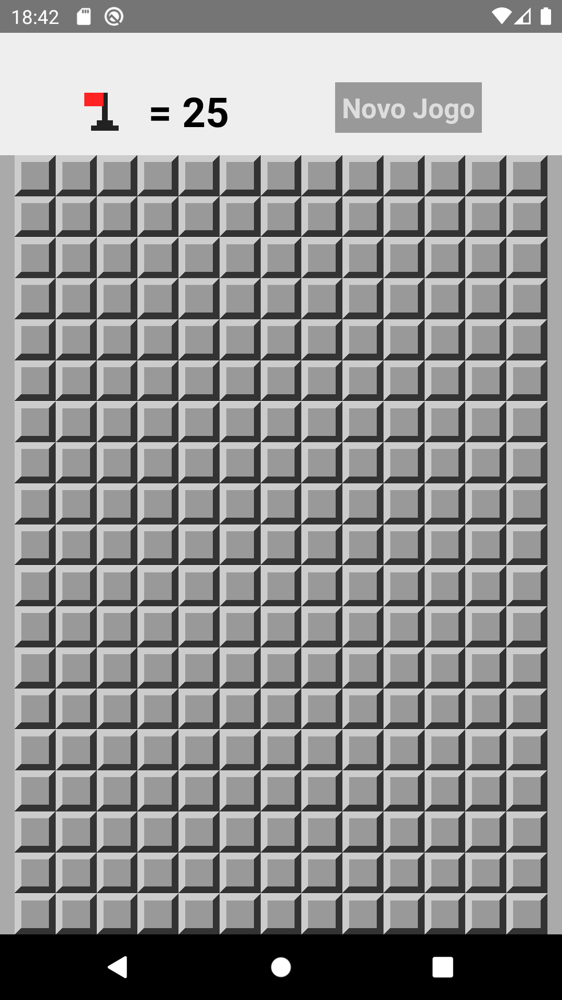

# Mines (Campo minado)
> O clássico jogo campo minado para mobile(Android e iOS), desenvolvido com react-native.

Esse aplicativo desenvolvido com react-native tem como base o jogo Campo minado, nele você vai encontrar o clássico tabuleiro do campo minado e poderá escolher entre três níveis: Fácil, Intermediário e Difícil. Caso desejar marcar um quadrante como perigoso, poderá pressionar o quadrante por um certo tempo e uma bandeira irá ser posta na posição. Cada quadrante poderá ter ou não um número, esse número identifica o número de minas nos quadrantes adjacentes, caso não aja nenhuma mina em um quadrante adjacente, o tabuleiro será aberto até uma mina ser encontrada.



## Instalação

Este aplicativo não possui nenhum deploy, caso desejar contribuir para o desenvolvimento siga para a próxima seção.

## Configuração para Desenvolvimento

Para fazer a instalação das dependências, baixe os arquivos que compõe o projeto. Será necessário ter o NodeJS instalado na sua máquina. No terminal, acesse a pasta em que os arquivos estão e digite o seguinte código:

```sh
npm install
```

Será feito a instalação de todas as dependências do projeto

## Histórico de lançamentos

* 0.0.1
    * Trabalho em andamento

## Meta

Rilton Moreira – rilton_moreira@hotmail.com


## Contributing

1. Faça o _fork_ do projeto (<https://github.com/RiltonSM/Mobile-Mines/fork>)
2. Crie uma _branch_ para sua modificação (`git checkout -b feature/fooBar`)
3. Faça o _commit_ (`git commit -am 'Add some fooBar'`)
4. _Push_ (`git push origin feature/fooBar`)
5. Crie um novo _Pull Request_

[npm-image]: https://img.shields.io/npm/v/datadog-metrics.svg?style=flat-square
[npm-url]: https://npmjs.org/package/datadog-metrics
[npm-downloads]: https://img.shields.io/npm/dm/datadog-metrics.svg?style=flat-square
[travis-image]: https://img.shields.io/travis/dbader/node-datadog-metrics/master.svg?style=flat-square
[travis-url]: https://travis-ci.org/dbader/node-datadog-metrics
[wiki]: https://github.com/seunome/seuprojeto/wiki
